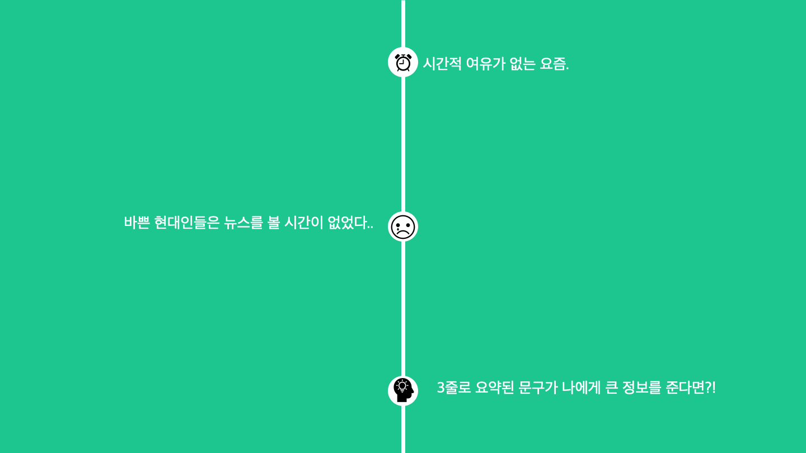

	
	
	

  

# Initialization

## Submodule
<pre>
git submodule update --init --recursive

cd ./server
npm install

cd ../app
npm install
</pre>
 

## Python Enviroment
<pre>
python -m venv .env

# unix & mac 
source .env/bin/activate 

# windows
.env\Scripts\activate.bat

# install packages
pip install -r requirements.txt 
</pre>

# News Recommandation

1. Topic
2. User based collaborative filtering
3. Item based collaborative filtering
4. Contents based filtering 

-------------

## 1. Topic

1. 뉴스 수집 (언론사 RSS )
2. 뉴스 해시태그 추출 ([eagle705/pytorch-bert-crf-ner](https://github.com/eagle705/pytorch-bert-crf-ner, 'pytorch-bert-crf-ner github link'))
3. 기간 중 가장 많이 모인 해시태그 뉴스 추천

 * 일정 수준 이상으로 모인 해시태그만 선정

## 2. User Based CF

1. 유저(A)가 선호 해시태그가 비슷한 유저(B)를 선정 
2. 유저(B)가 선호하는 뉴스 중 유저(A)가 보지 못한 뉴스 추천 

## 3. Item Based CF

	

## 4. Contents Based Filtering

> 유저가 선호하는 해시태그와 가장 근접한 뉴스를 선정

1. 가장 인기가 많은 뉴스를 선정 (10000개 이하, 조회수와 좋아요 갯수)
2. 뉴스 장르의 코사인 유사도를 계산하여 가장 유사한 뉴스 추천